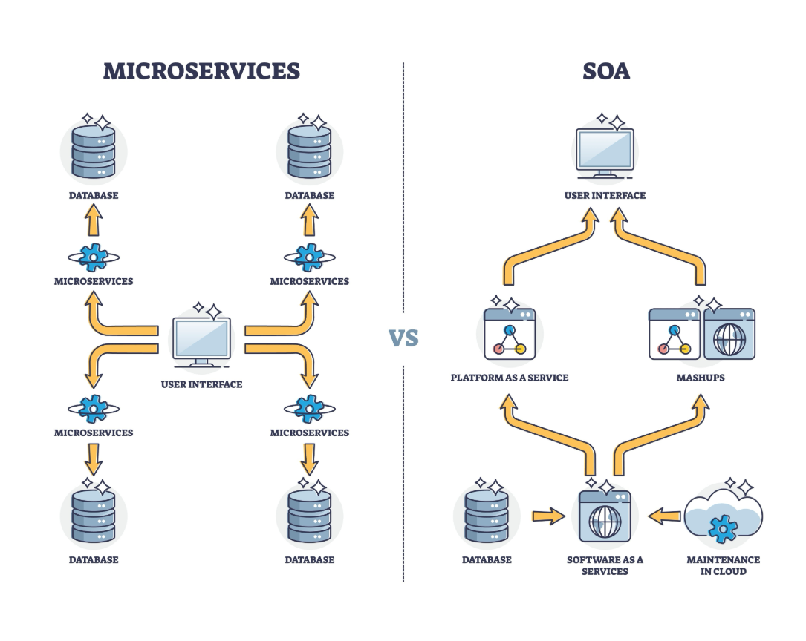

Arxitekturanın Üstünlükləri:
Scalability: Məsələn, gediş-gəlişin çox olduğu saatlarda yalnız "Live Tracking Service" miqyaslandırıla bilər.

Fault Tolerance: Əgər "Sustainability Analytics" servisi dayanarsa, istifadəçilər hələ də taksi sifariş edə və ödəniş edə bilərlər.

Technology Diversity: Hər bir servis öz ehtiyacına uyğun fərqli proqramlaşdırma dili və ya verilənlər bazası (məsələn, GPS üçün NoSQL) istifadə edə bilər.

